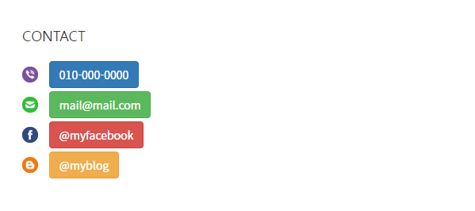
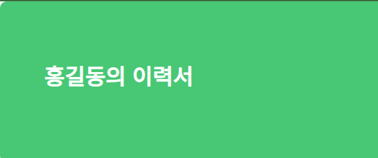

# CSS Framework

### 사용한 framework 사이트
>[bootstrap](https://www.w3schools.com/bootstrap/bootstrap_ref_all_classes.asp)   
>[bulma](https://bulma.io/)   
>[uikiy]([https://getuikit.com/[)

 * 버튼 모양 및 색 변경   
 </img>
     ```html
        <ul>
            <li>
                <a class="btn btn-info" href="tel:0100000000">010-000-0000</a>
            </li>
            <li>
                <a class="btn btn-info" href="mailto:mail@mail.com" target="_blank">mail@mail.com</a>
            </li>
            <li>
                <a class="btn btn-info" href="https://facebook.com/myfacebook" target="_blank">@myfacebook</a>
            </li>
            <li>
                <a class="btn btn-info" href="https://naver.blog.com/myblog" target="_blank">@myblog</a>
            </li>
        </ul>
    ```
 * 타이틀 배경 색상 변경*   
  </img>
 
        <div class="hero-body">
          <p class="title">
            홍길동의 이력서
          </p>
        </div>
      </section>
 
 * 프로필 모양 및 형태 변경*   

            <h2>My info</h2> 
            
            <table class="uk-table uk-table-divider">
                <tbody>
                    <tr id="myname">
                        <th>이름</th>
                        <td>홍길동</td>
                    </tr>
                    <tr>
                        <th>직업</th>
                        <td>개발자</td>
                    </tr>
                    <tr>
                        <th>나이</th>
                        <td>38</td>
                    </tr>
                    <tr>
                        <th>거주지</th>
                        <td>부산</td>
                    </tr>
                </tbody>
            </table>
        </section>
     ```

### 호스팅 주소
> [github.io](https://kimcm1.github.io/Game_pgm)   
> [netlify](https://cssframeworkks.netlify.app/)
